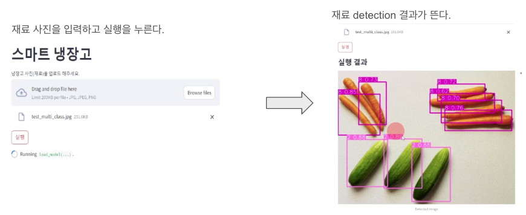
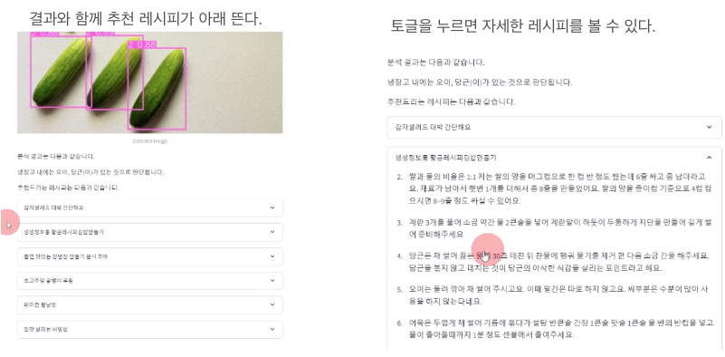
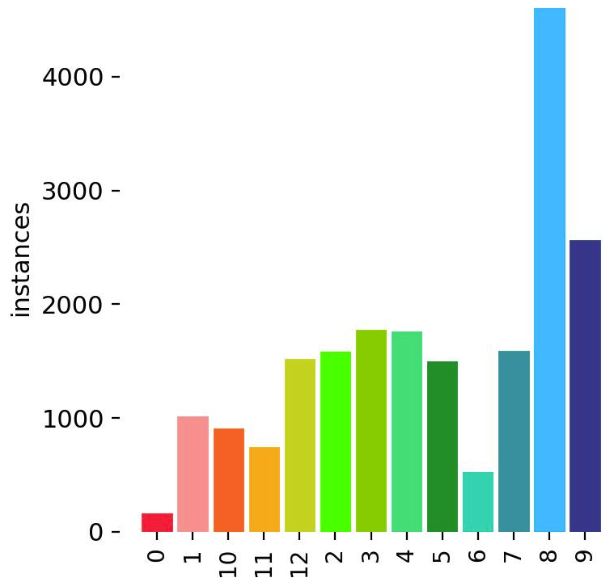
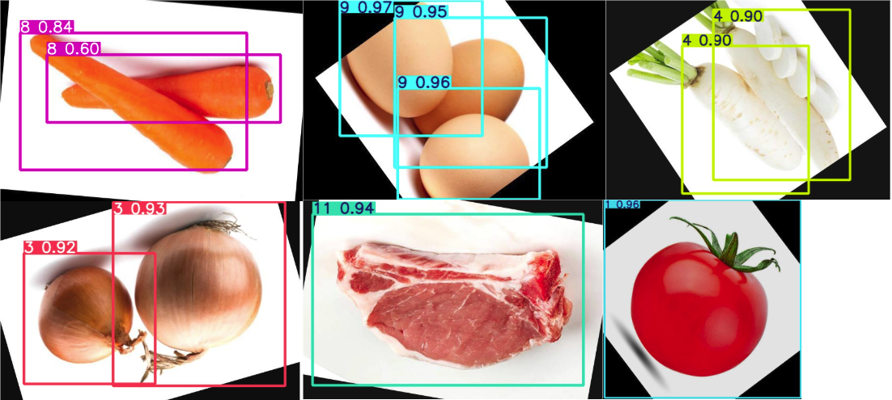
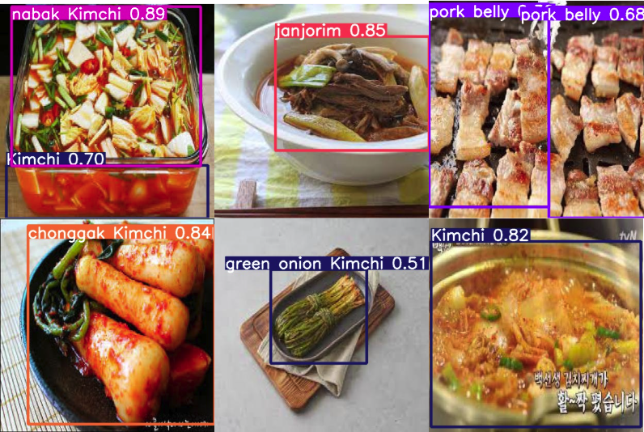
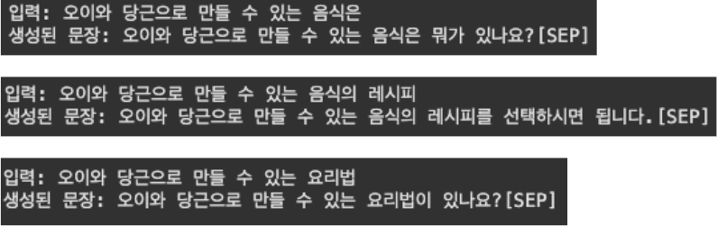

# 스마트 냉장고 & 레시피 추천 시스템

이 프로젝트는 YOLOv5를 활용한 식재료 인식과 음식 인식 시스템을 구현하고, MongoDB를 활용하여 레시피를 추천하는 웹 애플리케이션입니다.

## 데모 화면

## 데이터셋
* 음식재료 : https://universe.roboflow.com/seongmin/food-ingredients-pnisb

* 음식 : https://universe.roboflow.com/seongmin/food-pnisb

## 주요 기능

### 1. 스마트 냉장고
- 냉장고 사진을 업로드하면 YOLOv5 모델이 식재료를 자동으로 인식

- 인식된 식재료를 기반으로 만들 수 있는 요리 레시피 추천
- 13가지 식재료 인식 가능:
  - 감자, 토마토, 오이/애호박, 양파, 무, 가지, 파, 적양배추, 당근, 계란, 소고기, 돼지고기, 닭고기

### 2. 레시피 찾기
- 음식 사진을 업로드하면 YOLOv5 모델이 음식을 자동으로 인식

- 인식된 음식의 상세 레시피 제공
- 53가지 한식 메뉴 인식 가능

## 기술 스택

- **딥러닝 프레임워크**: PyTorch, YOLOv5
- **웹 프레임워크**: Streamlit
- **데이터베이스**: MongoDB
- **배포**: ngrok
- **기타 라이브러리**: OpenCV, NumPy, Pillow

## 시스템 구조

1. **데이터 수집 및 전처리**
   - Roboflow를 통한 식재료 및 음식 데이터셋 구축
   - YOLOv5 포맷으로 데이터 변환

2. **모델 학습**
   - YOLOv5n 모델 사용
   - 이미지 크기: 416x416
   - 배치 크기: 16
   - 학습 에포크: 200

3. **웹 애플리케이션**
   - Streamlit을 활용한 사용자 인터페이스 구현
   - MongoDB를 통한 레시피 데이터 관리
   - ngrok을 통한 외부 접속 지원

## 🆕 시스템 업그레이드 (2024 ver.)

### GPT-2 기반 레시피 생성 기능 추가
기존 MongoDB 기반의 레시피 매칭 시스템에 GPT2 모델을 도입하여 LLM을 도입할 계획이였습니다.

#### 결과

- GPT-2 모델의 구조적 한계로 인한 성능 제약
  - 단순 다음 단어 예측에 특화된 모델 구조
  - 레시피의 전체적인 문맥 파악 및 일관성 유지의 어려움
- GPT4 API를 사용하면 좋겠지만 gpt2 모델을 직접 만들어 본 것으로 만족합니다.
